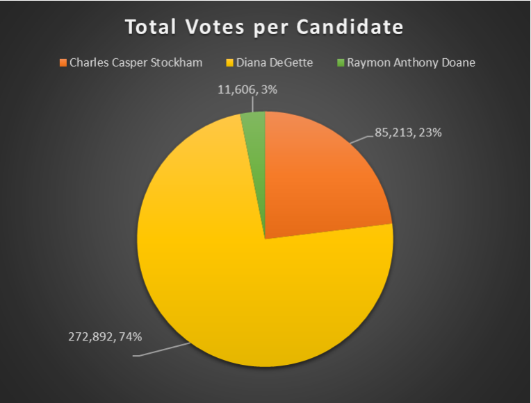
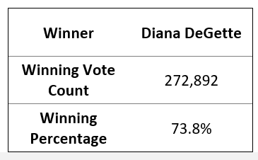
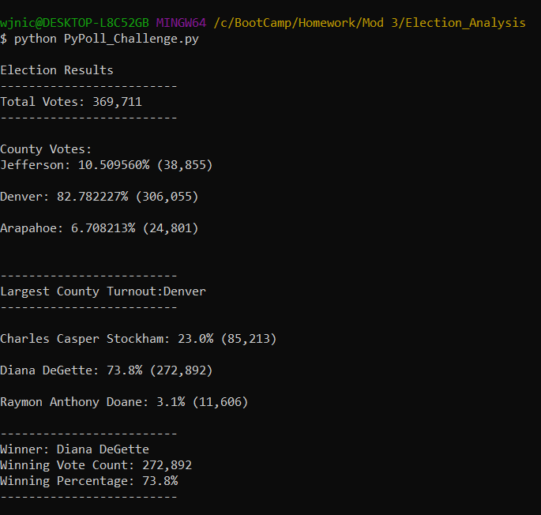

# Election Audit and Python Analysis

## Overview of Election Audit

### Purpose
Using Python as an alternative to Excel: audit a set of voting outcomes with an automated script.

## Election Audit Results
- Votes in this congressional election = 369,711

- Python Output

## Election Audit Summary
This is an example of code used in Python that can quickly evaluate large data sets and output specified information. With minor altercations, this code can be used for any election. Modifications to variables, list, and dictionaries within the code can expand and/or refine our ability to analyze voter data. It is better to use Python, over Excel, for a many reasons. Python can work on a larger scale, perform much more automation, provides more transparency and is easier to reproduce. (Folkman, 2020)

## Citation
Folkman, T. (2020, July 10). Why is Python better than Excel for Data analytics? Educative: Interactive Courses for Software Developers. Retrieved May 1, 2022, from https://www.educative.io/edpresso/why-is-python-better-than-excel-for-data-analytics
